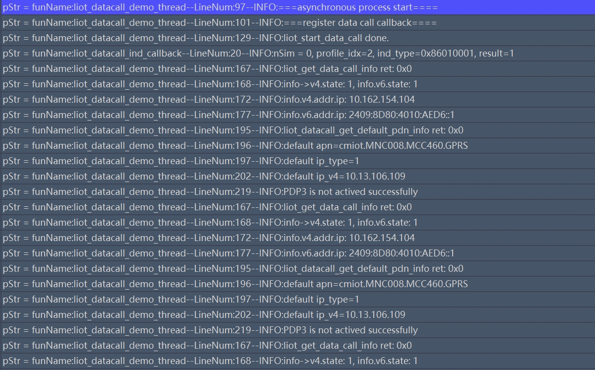

# Lierda LTE-EC71X OpenCPU 数据拨号开发指导_Rev1.0

{link_to_translation}`en:[English]`

## 文件修订历史

| **版本** | **日期** | **作者** | **修订内容** |
| ---- | ---- | ---- | ---- |
| Rev1.0 | 23-09-15 | YPP | 创建文档 |
| Rev1.1 | 24-03-25 | sxx | 更改文档名称 |
| Rev1.2 | 24-10-25 | LJZ | 修改文档格式 |
| Rev1.3 | 25-04-09 | ZW | 增加4.16章节，增加接口liot\_network\_register\_cereg\_get。 |
| Rev1.4 | 26-01-09 | ZLC | 增加4.16章节，新增接口。 |
| Rev2.0 | 26-03-03 | YMX | 修改文档格式 |

## 1 简介

本文档主要介绍 LTE-EC71X OpenCPU 数据拨号 API 函数详解，API 位于 `LSDK/components/kernel/lierda_api/liot_datacall/liot_datacall.h` 文件。

- **网络注册：** `liot_network_register_wait`（网络注册）是开机后的自动动作，但是如果是专网卡，需要先配置APN，然后再控制开关设备实现网络注册。
- **拨号激活：** `liot_start_data_call`（拨号）是手动获取业务 IP 的动作，要实现模组与基站之间的数据通讯，必须进行拨号。
- **默认承载（Default EPS Bearer）：** Cat.1 模组在附着成功后通常会自动激活 CID 1。

## 2 API 函数概览

### 2.1 核心控制

| **函数** | **说明** |
| ---- | ---- |
| `liot_start_data_call()` | 启动数据拨号 |
| `liot_stop_data_call()` | 终止数据拨号 |
| `liot_set_data_call_asyn_mode()` | 设置启动和终止数据拨号函数的执行模式 |
| `liot_datacall_set_nat()` | 启用 NAT 功能 |

### 2.2 状态查询

| **函数** | **说明** |
| ---- | ---- |
| `liot_get_data_call_info()` | 获取数据拨号信息 |
| `liot_datacall_get_sim_profile_is_active()` | 获取当前 PDP 上下文激活状态 |
| `liot_datacall_get_default_pdn_info()` | 获取默认承载信息 |
| `liot_network_register_wait()` | 等待网络注册结果 |
| `liot_network_register_cereg_get()` | 获取网络注册状态 |
| `liot_datacall_get_nat()` | 查询(U)SIM 卡对应的 NAT模式 |
| `Liot_DataCallCfgDefaultEpsBearer()` | 设置或查询默认承载（CID 1）的 APN 和 IP 类型 |

### 2.3 事件处理

| **函数** | **说明** |
| ---- | ---- |
| `liot_datacall_register_cb()` | 注册数据拨号的回调函数 |
| `liot_datacall_unregister_cb()` | 去注册数据拨号的回调函数 |
| `Liot_PsEventCb()` | 注册系统事件通知回调 |

### 2.4 IP地址工具

| **函数** | **说明** |
| ---- | ---- |
| `liot_ip4addr_ntoa()` | IPV4地址转字符串 |
| `liot_ip6addr_ntoa()` | IPV6地址转字符串 |
| `liot_ip4addr_aton()` | IPV4字符串转地址 |
| `liot_ip6addr_aton()` | IPV6字符串转地址 |

## 3 API 函数详解

### 3.1 liot\_datacall\_register\_cb

该函数用于注册数据拨号的回调函数。无论是异步模式还是同步模式，均需注册回调函数用于上报被网络去激活或者去附着的事件，当接收到此事件后可发起重新拨号流程。

1. 声明

```c
liot_datacall_errcode_e liot_datacall_register_cb(uint8_t nSim, int profile_idx, liot_datacall_callback datacall_cb, void *ctx)
```

2. 参数

- `nSim`：[In] 所用的(U)SIM 卡，若模块只支持 1 个(U)SIM 接口，此参数可设置为 0，取值：0-1或0XFF。
- `profile_idx`：[In] PDP 上下文 ID，范围：1~7或0XFF。
- `datacall_cb`：[In] 待注册的回调函数。详见 3.1.1 章。
- `ctx`：[In] 回调函数的传参指针。

3. 返回值

- `liot_datacall_errcode_e`：执行结果码，详见 3.1.2 章。

#### 3.1.1 liot\_datacall\_callback

该回调函数用于上报数据拨号事件。

1. 声明

```c
typedef void (*liot_datacall_callback)(uint8_t nSim, unsigned int ind_type, int profile_idx, bool result, void *ctx);
```

2. 参数

- `nSim`：[In] 所用的(U)SIM 卡，若模块只支持 1 个(U)SIM 接口，此参数可设置为 0，取值：0-1或0XFF。
- `ind_type`：[In] 数据拨号事件类型。

| **事件** | **说明** |
| ---- | ---- |
| LIOT\_DATACALL\_ACT\_RSP\_IND | 异步模式下 PDP 激活的结果响应事件 |
| LIOT\_DATACALL\_DEACT\_RSP\_IND | 异步模式下 PDP 反激活的结果响应事件 |
| LIOT\_DATACALL\_PDP\_DEACTIVE\_IND | PDP 被网络去激活或者去附着的事件 |

- `profile_idx`：[In] PDP 上下文 ID，范围：1~7或0XFF。
- `result`：[In] PDP 上下文激活和反激活的结果，0 失败，1 成功。
- `ctx`：[In] 回调函数的传参指针。

#### 3.1.2 liot\_datacall\_errcode\_e

数据拨号 API 执行结果错误码。

1. 声明

```c
typedef enum{
  LIOT_DATACALL_SUCCESS     = 0,
  LIOT_DATACALL_EXECUTE_ERR = 1 | LIOT_DATACALL_ERRCODE_BASE,
  LIOT_DATACALL_MEM_ADDR_NULL_ERR,
  LIOT_DATACALL_INVALID_PARAM_ERR,
  LIOT_DATACALL_NW_REGISTER_TIMEOUT_ERR,
  LIOT_DATACALL_CFW_ACT_STATE_GET_ERR = 5 | LIOT_DATACALL_ERRCODE_BASE,
  LIOT_DATACALL_REPEAT_ACTIVE_ERR,
  LIOT_DATACALL_REPEAT_DEACTIVE_ERR,
  LIOT_DATACALL_CFW_PDP_CTX_SET_ERR,
  LIOT_DATACALL_CFW_PDP_CTX_GET_ERR,
  LIOT_DATACALL_CS_CALL_ERR = 10 | LIOT_DATACALL_ERRCODE_BASE,
  LIOT_DATACALL_CFW_CFUN_GET_ERR,
  LIOT_DATACALL_CFUN_DISABLE_ERR,
  LIOT_DATACALL_NW_STATUS_GET_ERR,
  LIOT_DATACALL_NOT_REGISTERED_ERR,
  LIOT_DATACALL_NO_MEM_ERR = 15 | LIOT_DATACALL_ERRCODE_BASE,
  LIOT_DATACALL_CFW_ATTACH_STATUS_GET_ERR,
  LIOT_DATACALL_SEMAPHORE_CREATE_ERR,
  LIOT_DATACALL_SEMAPHORE_TIMEOUT_ERR,
  LIOT_DATACALL_CFW_ATTACH_REQUEST_ERR,
  LIOT_DATACALL_CFW_ACTIVE_REQUEST_ERR = 20 | LIOT_DATACALL_ERRCODE_BASE,
  LIOT_DATACALL_ACTIVE_FAIL_ERR,
  LIOT_DATACALL_CFW_DEACTIVE_REQUEST_ERR,
  LIOT_DATACALL_NO_DFTPDN_CFG_CONTEXT,
  LIOT_DATACALL_NO_DFTPDN_INFO_CONTEXT,
} liot_datacall_errcode_e;
```

2. 参数

| **参数** | **描述** |
| ---- | ---- |
| LIOT\_DATACALL\_SUCCESS | 执行成功 |
| LIOT\_DATACALL\_EXECUTE\_ERR | 执行失败 |
| LIOT\_DATACALL\_MEM\_ADDR\_NULL\_ERR | 参数地址为空 |
| LIOT\_DATACALL\_INVALID\_PARAM\_ERR | 参数无效 |
| LIOT\_DATACALL\_NW\_REGISTER\_TIMEOUT\_ERR | 网络注册超时 |
| LIOT\_DATACALL\_CFW\_ACT\_STATE\_GET\_ERR | 获取 PDP 上下文激活状态失败 |
| LIOT\_DATACALL\_REPEAT\_ACTIVE\_ERR | 重复激活 PDP 上下文 |
| LIOT\_DATACALL\_REPEAT\_DEACTIVE\_ERR | 重复反激活 PDP 上下文 |
| LIOT\_DATACALL\_CFW\_PDP\_CTX\_SET\_ERR | 设置 PDP 上下文失败 |
| LIOT\_DATACALL\_CFW\_PDP\_CTX\_GET\_ERR | 获取 PDP 上下文失败 |
| LIOT\_DATACALL\_CS\_CALL\_ERR | 正在通话导致数据业务操作失败 |
| LIOT\_DATACALL\_CFW\_CFUN\_GET\_ERR | 获取功能模式失败 |
| LIOT\_DATACALL\_CFUN\_DISABLE\_ERR | 非全功能模式导致数据业务操作失败 |
| LIOT\_DATACALL\_NW\_STATUS\_GET\_ERR | 获取网络注册状态失败 |
| LIOT\_DATACALL\_NOT\_REGISTERED\_ERR | 网络未注册 |
| LIOT\_DATACALL\_NO\_MEM\_ERR | 申请内存失败 |
| LIOT\_DATACALL\_CFW\_ATTACH\_STATUS\_GET\_ERR | 获取网络附着状态失败 |
| LIOT\_DATACALL\_SEMAPHORE\_CREATE\_ERR | 创建信号量失败 |
| LIOT\_DATACALL\_SEMAPHORE\_TIMEOUT\_ERR | 等待信号量超时 |
| LIOT\_DATACALL\_CFW\_ATTACH\_REQUEST\_ERR | 网络附着被拒 |
| LIOT\_DATACALL\_CFW\_ACTIVE\_REQUEST\_ERR | PDP 上下文激活被拒 |
| LIOT\_DATACALL\_ACTIVE\_FAIL\_ERR | PDP 上下文激活失败 |
| LIOT\_DATACALL\_CFW\_DEACTIVE\_REQUEST\_ERR | PDP 上下文去激活被拒 |
| LIOT\_DATACALL\_NO\_DFTPDN\_CFG\_CONTEXT | 未配置默认承载上下文 |
| LIOT\_DATACALL\_NO\_DFTPDN\_INFO\_CONTEXT | 无默认承载上下文信息 |

### 3.2 liot\_datacall\_unregister\_cb

该函数用于取消通过 `liot_datacall_register_cb()` 注册的回调函数。取消后，回调函数将不再接收数据拨号的相关事件。

1. 声明

```c
liot_datacall_errcode_e liot_datacall_unregister_cb(uint8_t nSim, int profile_idx, liot_datacall_callback datacalliot_cb, void *ctx);
```

2. 参数

- `nSim`：[In] 所用的 (U)SIM 卡，若模块只支持 1 个 (U)SIM 接口，此参数可设置为 0，取值：0-1或0XFF。
- `profile_idx`：[In] PDP 上下文 ID，范围：1~7或0XFF。
- `datacall_cb`：[In] 待取消注册的回调函数。详见 3.1.1 章。
- `ctx`：[In] 回调函数的传参指针。

3. 返回值

- `liot_datacall_errcode_e`：执行结果码，详见 3.1.2 章。

### 3.3 liot\_get\_data\_call\_info

该函数用于获取数据拨号信息。

1. 声明

```c
liot_datacall_errcode_e liot_get_data_call_info(UINT8 nSim, INT32 profile_idx, liot_data_call_info_t *call_info);
```

2. 参数

- `nSim`：[In] 所用的 (U)SIM 卡。若模块只支持 1 个 (U)SIM 接口，此参数可设置为 0。取值：0-1。
- `profile_idx`：[In] PDP 上下文 ID，范围：1~7。
- `call_info`：[Out] 数据拨号信息。详见 3.3.1 章。

3. 返回值

- `liot_datacall_errcode_e`：执行结果码，详见 3.1.2 章。

#### 3.3.1 liot\_data\_call\_info\_t

数据拨号信息。

1. 声明

```c
typedef struct{
  INT32 cid;
  INT32 ip_version;
  liot_v4_info v4;
  liot_v6_info v6;
  char apn_name[LIOT_APN_LEN_MAX];
} liot_data_call_info_t;
```

2. 参数

| **参数** | **类型** | **描述** |
| ---- | ---- | ---- |
| cid | INT32 | PDP 上下文 ID。范围：1~7。 |
| ip\_version | INT32 | IP 类型。1 IPv4，2 IPv6，3 IPv4v6 |
| v4 | liot\_v4\_info | IPv4 信息。详见 3.3.2 章。 |
| v6 | liot\_v6\_info | IPv6 信息。详见 3.3.5 章。 |
| apn\_name | char | apn 名字，字符串最大长度为64。 |

#### 3.3.2 liot\_v4\_info

IPv4 信息。

1. 声明

```c
typedef struct
{
  INT32 state;
  liot_v4_address_status addr;
} liot_v4_info;
```

2. 参数

| **参数** | **类型** | **描述** |
| ---- | ---- | ---- |
| state | INT32 | 拨号状态。0 未拨号，1 拨号成功 |
| addr | liot\_v4\_address\_status | IPv4 地址状态。详见 3.3.3 章。 |

#### 3.3.3 liot\_v4\_address\_status

IPv4 地址状态。

1. 声明

```c
typedef struct
{
  liot_ip4_addr_t ip;
  liot_ip4_addr_t pri_dns;
  liot_ip4_addr_t sec_dns;
} liot_v4_address_status;
```

2. 参数

| **参数** | **类型** | **描述** |
| ---- | ---- | ---- |
| ip | liot\_ip4\_addr\_t | 获取的 IPv4 地址。详见 3.3.4 章。 |
| pri\_dns | liot\_ip4\_addr\_t | 主域名服务器 IPv4 地址。详见 3.3.4 章。 |
| sec\_dns | liot\_ip4\_addr\_t | 辅助域名服务器 IPv4 地址。详见 3.3.4 章。 |

#### 3.3.4 liot\_ip4\_addr\_t

IPv4 地址。

1. 声明

```c
typedef struct
{
  UINT32 addr;
} liot_ip4_addr_t;
```

2. 参数

| **参数** | **类型** | **描述** |
| ---- | ---- | ---- |
| addr | UINT32 | IPv4 地址。 |

#### 3.3.5 liot\_v6\_info

IPv6 信息。

1. 声明

```c
typedef struct
{
  INT32 state;
  liot_v6_address_status addr;
} liot_v6_info;
```

2. 参数

| **参数** | **类型** | **描述** |
| ---- | ---- | ---- |
| state | INT32 | 拨号状态。0 未拨号，1 拨号成功 |
| addr | liot\_v6\_address\_status | IPv6 地址状态。详见 3.3.6 章。 |

#### 3.3.6 liot\_v6\_address\_status

IPv6 地址状态。

1. 声明

```c
typedef struct
{
  liot_ip6_addr_t ip;
  liot_ip6_addr_t pri_dns;
  liot_ip6_addr_t sec_dns;
} liot_v6_address_status;
```

2. 参数

| **参数** | **类型** | **描述** |
| ---- | ---- | ---- |
| ip | liot\_ip6\_addr\_t | 获取的 IPv6 地址。详见 3.3.7 章。 |
| pri\_dns | liot\_ip6\_addr\_t | 主域名服务器 IPv6 地址。详见 3.3.7 章。 |
| sec\_dns | liot\_ip6\_addr\_t | 辅助域名服务器 IPv6 地址。详见 3.3.7 章。 |

#### 3.3.7 liot\_ip6\_addr\_t

IPv6 地址。

1. 声明

```c
typedef struct
{
  UINT32 addr[4];
} liot_ip6_addr_t;
```

2. 参数

| **参数** | **类型** | **描述** |
| ---- | ---- | ---- |
| addr | UINT32 | IPv6 地址，大小为4字节。 |

### 3.4 liot\_start\_data\_call

该函数用于启动数据拨号。默认为同步模式，如需异步模式请通过 `liot_set_data_call_asyn_mode()` 进行设置。同步模式和异步模式区别如下所示：

1. 同步模式：函数执行结束后返回数据拨号的结果码，若返回 `LIOT_DATACALL_SUCCESS` 则表示数据拨号成功，获取到 IP 地址，可进行 socket 通信。
2. 异步模式：函数执行结束后返回函数执行结果码，若返回 `LIOT_DATACALL_SUCCESS` 并不表示数据拨号成功，仅表示函数执行成功，注册的回调函数将通过 `LIOT_DATACALL_ACT_RSP_IND` 事件通知上层是否拨号成功。
3. 声明

```c
liot_datacall_errcode_e liot_start_data_call(UINT8 nSim, INT32 cid, INT32 ip_version, CHAR *apn_name, CHAR *username, CHAR *password, INT32 auth_type);
```

2. 参数

- `nSim`：[In] 所用的 (U)SIM 卡。若模块只支持 1 个 (U)SIM 接口，此参数可设置为 0。取值：0-1。
- `cid`：[In] PDP 上下文 ID，范围：1~7。
- `ip_version`：[In] IP 版本：1 IPv4，2 IPv6，3 IPv4v6。
- `apn_name`：[In] APN 名称。
- `username`：[In] 用户名称。
- `password`：[In] 用户密码。
- `auth_type`：[In] 认证类型。详见 3.4.1 章。

3. 返回值

- `liot_datacall_errcode_e`：执行结果码，详见 3.1.2 章。

#### 3.4.1 liot\_data\_auth\_type\_e

认证类型。

1. 声明

```c
typedef enum
{
  LIOT_DATA_AUTH_TYPE_AUTO = 0xFF,
  LIOT_DATA_AUTH_TYPE_NONE = 0,
  LIOT_DATA_AUTH_TYPE_PAP,
  LIOT_DATA_AUTH_TYPE_CHAP,
} liot_data_auth_type_e;
```

2. 参数

| **参数** | **描述** |
| ---- | ---- |
| LIOT\_DATA\_AUTH\_TYPE\_AUTO | 自动选择 PAP 或 CHAP 认证协议 |
| LIOT\_DATA\_AUTH\_TYPE\_NONE | 无认证协议 |
| LIOT\_DATA\_AUTH\_TYPE\_PAP | PAP 认证协议 |
| LIOT\_DATA\_AUTH\_TYPE\_CHAP | CHAP 认证协议 |

### 3.5 liot\_datacall\_get\_default\_pdn\_info

该函数用于获取默认承载信息。

1. 声明

```c
liot_datacall_errcode_e liot_datacall_get_default_pdn_info(uint8_t nSim, liot_data_call_default_pdn_info_s *ctx);
```

2. 参数

- `nSim`：[In] 所用的 (U)SIM 卡。若模块只支持 1 个 (U)SIM 接口，此参数可设置为 0。取值：0-1。
- `ctx`：[Out] 承载信息。详见 3.5.1 章。

3. 返回值

- `liot_datacall_errcode_e`：执行结果码，详见 3.1.2 章。

#### 3.5.1 liot\_data\_call\_default\_pdn\_info\_s

默认承载信息结构体。

1. 声明

```c
typedef struct{
  uint8_t ip_version;
  liot_ip4_addr_t ipv4;
  liot_ip6_addr_t ipv6;
  char apn_name[LIOT_APN_LEN_MAX];
} liot_data_call_default_pdn_info_s;
```

2. 参数

| **参数** | **类型** | **描述** |
| ---- | ---- | ---- |
| ip\_version | uint8\_t | IP 类型。1 IPv4，2 IPv6，3 IPv4v6 |
| ipv4 | liot\_ip4\_addr\_t | IPv4 信息。详见 3.3.4 章。 |
| ipv6 | liot\_ip6\_addr\_t | IPv6 信息。详见 3.3.7 章。 |
| apn\_name | char | apn 名字，字符串最大长度为64。 |

### 3.6 liot\_datacall\_get\_sim\_profile\_is\_active

该函数用于获取当前 PDP 上下文激活状态。

1. 声明

```c
bool liot_datacall_get_sim_profile_is_active(uint8_t nSim, int profile_idx);
```

2. 参数

- `nSim`：[In] 所用的 (U)SIM 卡。若模块只支持 1 个 (U)SIM 接口，此参数可设置为 0。取值：0-1。
- `profile_idx`：[In] PDP 上下文 ID，范围：1~7。

3. 返回值

- `true` 已激活，`false` 未激活。

### 3.7 liot\_stop\_data\_call

该函数用于终止数据拨号。默认为同步模式，如需异步模式请通过 `liot_set_data_call_asyn_mode()` 进行设置。当停止拨号时，所有依赖此 cid 的 Socket 连接都将被强制关闭。

1. 声明

```c
liot_datacall_errcode_e liot_stop_data_call(UINT8 nSim, INT32 profile_idx);
```

2. 参数

- `nSim`：[In] 所用的 (U)SIM 卡。若模块只支持 1 个 (U)SIM 接口，此参数可设置为 0。取值：0-1。
- `profile_idx`：[In] PDP 上下文 ID，范围：1~7。

3. 返回值

- `liot_datacall_errcode_e`：执行结果码，详见 3.1.2 章。

### 3.8 liot\_set\_data\_call\_asyn\_mode

该函数用于设置启动和终止数据拨号函数（即 `liot_start_data_call()` 和 `liot_stop_data_call()`）的执行模式。执行模式分为同步和异步两种模式。必须在 `liot_start_data_call` 之前调用，以配置执行模式。

1. 声明

```c
liot_datacall_errcode_e liot_set_data_call_asyn_mode(uint8_t nSim, int profile_idx, bool enable);
```

2. 参数

- `nSim`：[In] 所用的 (U)SIM 卡。若模块只支持 1 个 (U)SIM 接口，此参数可设置为 0。取值：0-1。
- `profile_idx`：[In] PDP 上下文 ID，范围：1~7。
- `enable`：[In] 函数执行模式：0 同步模式，1 异步模式。

3. 返回值

- `liot_datacall_errcode_e`：执行结果码，详见 3.1.2 章。

### 3.9 liot\_network\_register\_wait

该函数用于等待网络注册结果。网络注册是开机后自动完成的，只有注册成功后，才可进行数据拨号。若当前未注册网络，将阻塞当前调用该函数的线程，直至在网络注册成功或超时后退出。

该函数属于同步函数，会在超时时间内等待网络注册成功后返回，超时时间到了还未注册到网络，返回注册失败。建议在独立的线程中调用该接口。

1. 声明

```c
liot_datacall_errcode_e liot_network_register_wait(uint8_t nSim, unsigned int timeout_s);
```

2. 参数

- `nSim`：[In] 所用的 (U)SIM 卡。若模块只支持 1 个 (U)SIM 接口，此参数可设置为 0。取值：0-1。
- `timeout_s`：[In] 等待网络注册的超时时间。单位：秒。

3. 返回值

- `liot_datacall_errcode_e`：执行结果码，详见 3.1.2 章。

### 3.10 liot\_datacall\_set\_nat

该函数用于启用 NAT 功能。模块重启后配置生效。NAT功能通常在模组作为 RNDIS/ECM 网卡使用时才会启用。

1. 声明

```c
liot_datacall_errcode_e liot_datacall_set_nat(uint8_t nSim, UINT32 natmode);
```

2. 参数

- `nSim`：[In] 所用的 (U)SIM 卡。若模块只支持 1 个 (U)SIM 接口，此参数可设置为 0。取值：0-1。
- `natmode`：[In] NAT 模式：0 使能，1 去使能。

3. 返回值

- `liot_datacall_errcode_e`：执行结果码，详见 3.1.2 章。

### 3.11 liot\_datacall\_get\_nat

该函数用于查询 (U)SIM 卡对应的 NAT 模式。

1. 声明

```c
liot_datacall_errcode_e liot_datacall_get_nat(uint8_t nSim, UINT32 *natmode);
```

2. 参数

- `nSim`：[In] 所用的 (U)SIM 卡。若模块只支持 1 个 (U)SIM 接口，此参数可设置为 0。取值：0-1。
- `natmode`：[Out] NAT 模式：0 使能，1 去使能。

3. 返回值

- `liot_datacall_errcode_e`：执行结果码，详见 3.1.2 章。

### 3.12 liot\_ip4addr\_ntoa

该函数用于 IPV4 地址转字符串，目的是将二进制IP地址转换为用户可读字符串。

1. 声明

```c
CHAR *liot_ip4addr_ntoa(liot_ip4_addr_t *addr);
```

2. 参数

- `addr`：[In] IPV4 地址指针。详见 3.3.4 章。

3. 返回值

- 字符串。

### 3.13 liot\_ip6addr\_ntoa

该函数用于 IPV6 地址转字符串，目的是将二进制IP地址转换为用户可读字符串。

1. 声明

```c
CHAR *liot_ip6addr_ntoa(liot_ip6_addr_t *addr);
```

2. 参数

- `addr`：[In] IPV6 地址指针。详见 3.3.7 章。

3. 返回值

- 字符串。

### 3.14 liot\_ip4addr\_aton

该函数用于 IPV4 字符串转地址，将用户可读的 IPv4 地址字符串转换为网络编程所需的二进制格式。

1. 声明

```c
BOOL liot_ip4addr_aton(CHAR *cp, liot_ip4_addr_t *addr);
```

2. 参数

- `cp`：[In] IPV4 字符串。
- `addr`：[Out] IPV4 地址指针。详见 3.3.4 章。

3. 返回值

- `true` 成功，`false` 失败。

### 3.15 liot\_ip6addr\_aton

该函数用于 IPV6 字符串转地址，将用户可读的 IPv6 地址字符串转换为网络编程所需的二进制格式。

1. 声明

```c
BOOL liot_ip6addr_aton(CHAR *cp, liot_ip6_addr_t *addr);
```

2. 参数

- `cp`：[In] IPV6 字符串。
- `addr`：[Out] 转换后 IPV6 地址指针。详见 3.3.7 章。

3. 返回值

- `true` 成功，`false` 失败。

### 3.16 liot\_network\_register\_cereg\_get

该函数用于获取网络注册状态。等同于底层 CEREG (Cellular Register) 状态的查询接口的返回。

1. 声明

```c
liot_datacall_errcode_e liot_network_register_cereg_get(uint8_t nSim);
```

2. 参数

- `nSim`：[In] 所用的(U)SIM 卡，若模块只支持 1 个(U)SIM 接口，此参数可设置为 0，取值：0-1或0XFF。

3. 返回值

- `liot_datacall_errcode_e`：执行结果码，详见 3.1.2 章。

### 3.17 Liot\_PsEventCb

该函数注册回调函数，获取系统注网、拨号、OOS事件。

`Liot_PsEventCb` 用于监控整体网络状态（注网、OOS），而 `liot_datacall_register_cb` 专注于拨号接口发起后异步响应的事件。

1. 声明

```c
liot_datacall_errcode_e Liot_PsEventCb(Liot_PsEventCallback_t callback);
```

2. 参数

- `callback`：[In] 用户注册的事件通知回调，当发生注网、拨号、OOS事件时会进行通知。

3. 返回值

- `liot_datacall_errcode_e`：执行结果码，详见 3.1.2 章。

#### 3.17.1 Liot\_PsEventCallback\_t

该回调函数用于上报注网、拨号、OOS事件。

1. 声明

```c
typedef void (*Liot_PsEventCallback_t)(Liot_PsEvent_e eventId, void *param, UINT32 paramLen);
```

2. 参数

- `eventId`：[In] 通知事件ID。

| **事件** | **说明** |
| ---- | ---- |
| LIOT\_PS\_EVENT\_BEARER\_ACTED | 网络注册成功 |
| LIOT\_PS\_EVENT\_BEARER\_DEACTED | 网络注册失败 |
| LIOT\_PS\_EVENT\_NETIF\_OOS | 无服务（Out of Service） |
| LIOT\_PS\_EVENT\_NETIF\_ACTIVATED | 网络接口附着成功 |
| LIOT\_PS\_EVENT\_NETIF\_DEACTIVATED | 网络接口附着失败 |
| LIOT\_PS\_EVENT\_MAX | 枚举最大值（用作边界检查） |

- `param`：[In] 回调函数事件对应的参数，暂未使用。
- `paramLen`：[In] 回调函数事件对应的参数长度，暂未使用。

### 3.18 Liot\_DataCallCfgDefaultEpsBearer

该函数设置或查询默认承载（CID 1）的 APN 和 IP 类型。

1. 声明

```c
liot_datacall_errcode_e Liot_DataCallCfgDefaultEpsBearer(Liot_DataCallCFG_t *cfg);
```

2. 参数

- `cfg`：[In] 配置结构体。详见 3.18.1 章。

3. 返回值

- `liot_datacall_errcode_e`：执行结果码，详见 3.1.2 章。

#### 3.18.1 Liot\_DataCallCFG\_t

配置默认承载结构体。

1. 声明

```c
typedef struct
{
    Liot_DataCallMethod_e method;       ///< 操作方法：设置或查询配置
    Liot_DataCallIpType_e ip_version;   ///< IP 类型
    char apn[LIOT_APN_LEN_MAX];         ///< APN 字符串
    uint16_t apn_len;                   ///< APN 字符串的实际长度
} Liot_DataCallCFG_t;
```

2. 参数

| **类型** | **参数** | **描述** |
| ---- | ---- | ---- |
| Liot\_DataCallMethod\_e | method | 操作方法：设置或查询配置 |
| Liot\_DataCallIpType\_e | ip\_version | 设置或查询的 IP 类型（V4/V6/IPV4V6） |
| char | apn | APN，最大100字节 |
| uint16\_t | apn\_len | APN 字符串的实际长度 |

#### 3.18.2 Liot\_DataCallMethod\_e

操作方法枚举定义：设置或查询配置。

1. 声明

```c
typedef enum
{
    LIOT_DATACALL_APN_SET,  ///< 设置 APN 配置
    LIOT_DATACALL_APN_GET,  ///< 查询 APN 配置
    LIOT_DATACALL_APN_MAX   ///< 最大值（用于边界检查）
} Liot_DataCallMethod_e;
```

2. 参数

| **枚举值** | **说明** |
| ---- | ---- |
| LIOT\_DATACALL\_APN\_SET | 设置 APN 配置 |
| LIOT\_DATACALL\_APN\_GET | 查询 APN 配置 |
| LIOT\_DATACALL\_APN\_MAX | 最大值（用于边界检查） |

#### 3.18.3 Liot\_DataCallIpType\_e

定义 IP 类型的枚举。

1. 声明

```c
typedef enum
{
    LIOT_PS_PDN_TYPE_IP_V4 = 1,  ///< IPv4 类型
    LIOT_PS_PDN_TYPE_IP_V6,      ///< IPv6 类型
    LIOT_PS_PDN_TYPE_IP_V4V6,    ///< IPv4/IPv6 双栈类型
    LIOT_PS_PDN_TYPE_NUM         ///< IP 类型数量（用作计数）
} Liot_DataCallIpType_e;
```

2. 参数

| **枚举值** | **说明** |
| ---- | ---- |
| LIOT\_PS\_PDN\_TYPE\_IP\_V4 | IPv4 类型 |
| LIOT\_PS\_PDN\_TYPE\_IP\_V6 | IPv6 类型 |
| LIOT\_PS\_PDN\_TYPE\_IP\_V4V6 | IPv4/IPv6 双栈类型 |
| LIOT\_PS\_PDN\_TYPE\_NUM | IP 类型数量（用作计数） |

## 4 代码示例

示例代码参考 `LSDK/examples/demo/src/demo_datacall.c` 文件。如下运行结果则说明获取所有信息正常：

- 同步模式

<div align="center">


</div>

- 异步模式

<div align="center">



</div>

## 5 名词解释

- **PDN Context**：Packet Data Network Context 是模组与运营商网络建立数据通道的逻辑实体。
- **CID**：profile\_idx (CID) 是该通道的 ID，范围通常为 1-7。CID 是后续所有网络操作（DNS、Socket）需要的标识符，用于标识通过哪个通道建立数据业务。
- **APN**：Access Point Name 是运营商网络的接入点。它是激活 PDN Context 的关键参数。确保 APN 名称正确。

