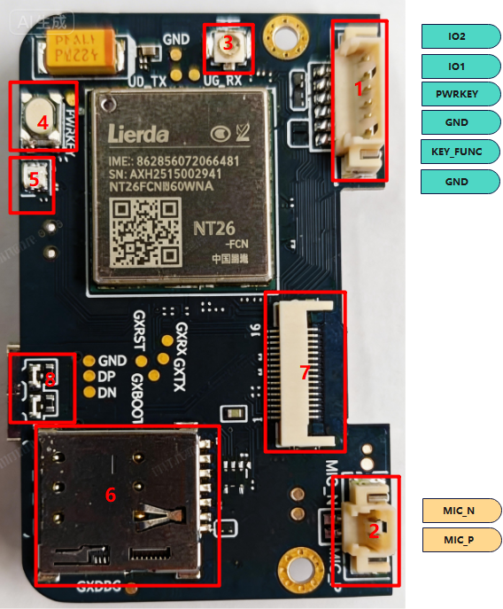
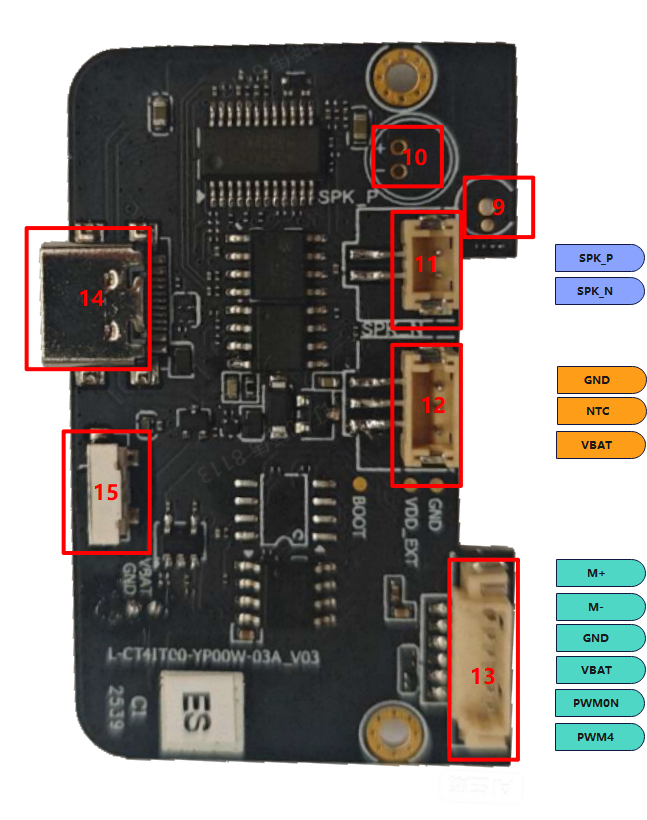
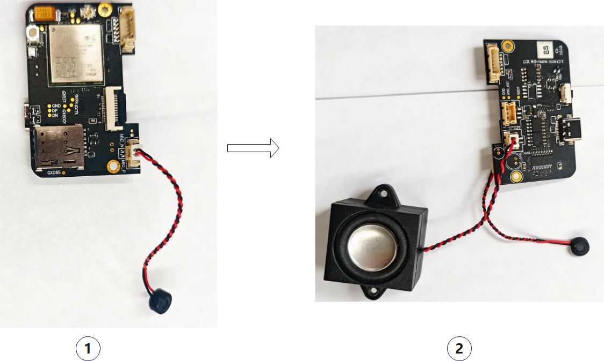
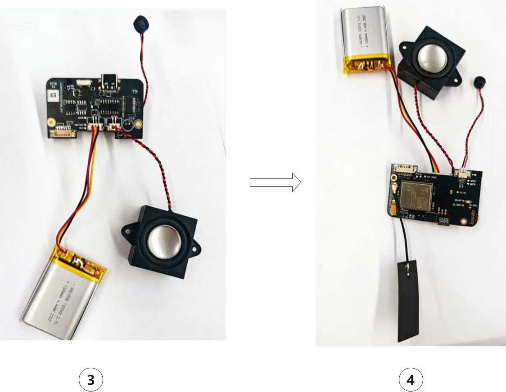
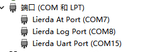
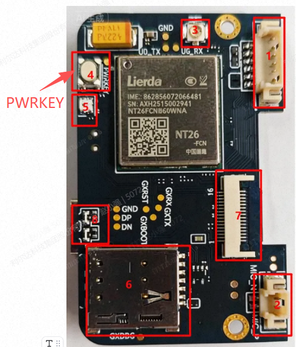
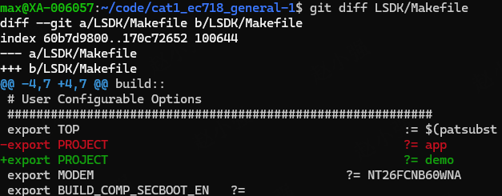
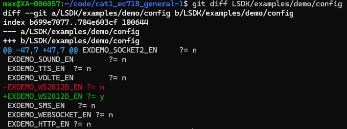
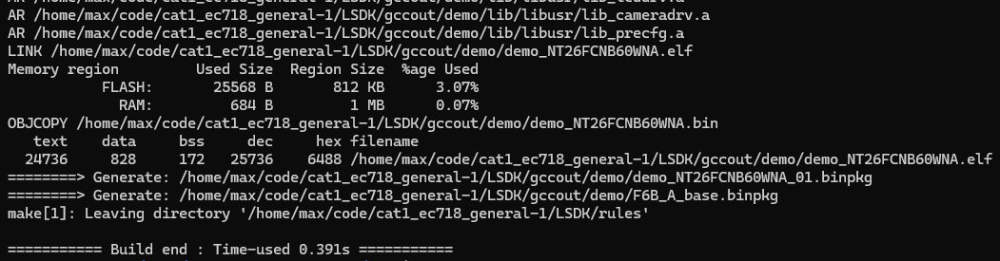
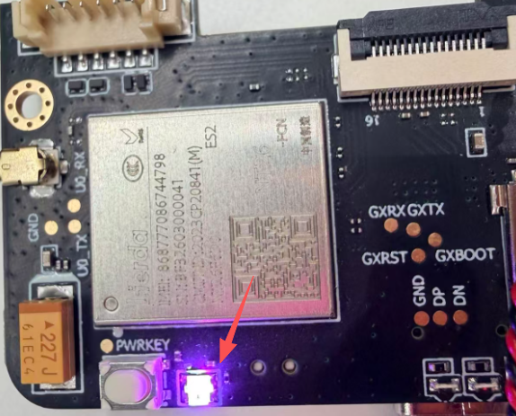

# Lierda LTE-EC71X OpenCPU 新手快速开发指南（基于03硬件）_Rev1.0

{link_to_translation}`en:[English]`

## 文件修订历史

| **版本** | **日期** | **作者** | **审核** | **修订内容** |
| ---- | ---- | ---- | ---- | ---- |
| Rev1.0 | 2026-03-27 | zxq | zlc | 创建文档 |

## 1 简介

本文介绍了03硬件的基本情况，介绍如何上手使用，安装驱动，固件下载以及软件上如何跑通一个demo，以帮助客户快速熟悉软硬件环境。

## 2 初识开发板

### 2.1 开发板硬件功能介绍

在开始之前，了解一些产品的基本参数非常重要。下表提供了NT26-EC718PM AI开发板的特性信息。

#### 2.1.1 开发板A面功能

1. 按键接口：可接1.25mm/6PIN端子和连接线外接按键，线序如下：

| **PIN序号** | **1** | **2** | **3** | **4** | **5** | **6** |
| ---- | ---- | ---- | ---- | ---- | ---- | ---- |
| 功能 | GND | `KEY_FUNC` | GND | `PWRKEY` | IO1/UART | IO2/UART |
| 电平系统 |  | 1.8V |  | 1.8V | 1.8V | 1.8V |

2. MIC接口：可接1.25mm/2PIN端子接口驻极体麦克风，与序号9的on board麦克风复用；
3. 天线接口：IPEX-1代天线座子，用于连接天线；
4. PWRKEY按键：短按500ms开机，长按650ms关机；
5. RGB指示灯：交互状态蓝色闪烁。开机绿灯常亮2秒，进入关机状态绿灯闪3下；
6. SIM卡插卡接口；
7. LCD和触摸屏接口，支持SPI，能够驱动双目显示、320*240分辨率的LCD屏幕和触摸屏；
8. 充电状态指示灯：充电时红灯常亮，充满后绿灯常亮；

#### 2.1.2 开发板B面功能

9. 振动开关：振动时短接，可检测振动；
10. On board麦克风：灵敏度-44dB/±3dB，与序号2的MIC接口复用；
11. 喇叭接口：可接1.5mm/2PIN端子的喇叭，支持4Ω3W喇叭。
12. 电池接口：可接1.5mm/3PIN端子的3.7V电池，最高充电电压为4.2V，默认支持NTC，推荐热敏电阻参数10KΩ，B25/50=3435，接口线序如下：

| **PIN序号** | **1** | **2** | **3** |
| ---- | ---- | ---- | ---- |
| 功能 | VBAT | NTC | GND |

13. 电机驱动接口：可驱动直流电机和舵机，接口线序如下：

| **PIN序号** | **1** | **2** | **3** | **4** | **5** | **6** |
| ---- | ---- | ---- | ---- | ---- | ---- | ---- |
| 功能 | PWM4 | PWM0N | VBAT | GND | M- | M+ |

14. USB口：Type-C接口，接入5V适配器可用于充电，也可用于USB通信
15. RST按键：复位模组
16. 显示和触摸屏接口

### 2.2 硬件外设安装

#### 2.2.1 主板和麦克风，扬声器安装

在NT26-EC718PM AI开发板图1 A面左下角，有一个独立的MIC接口，如图1中的右下角，分别是`MIC_P`和`MIC_N`，对应于`MIC_P`对应MIC红线，`MIC_N`对应MIC的黑线。接口自带卡口和防呆设计，用力能够正常插入就可以。自备MIC要注意线序。卸载MIC的时候不要直接拉线，需要捏住MIC插头的裸露出来的部分左右摇晃的缓慢拔下来。避免MIC的线和插头断连。

在NT26-EC718PM AI开发板图2 B面左下角，有一个独立的SPK喇叭接口，如图2中的左下角，分别是`SPK_P`与`SPK_N`，扬声器无极性要求，接口自带卡口和防呆设计，用力能够正常插入就可以。自备扬声器要注意线序。卸载扬声器的时候不要直接拉线，需要捏住扬声器插头的裸露出来的部分左右摇晃的缓慢拔下来。避免扬声器的线和插头断连。

#### 2.2.2 主板与电池和天线安装

在NT26-EC718PM AI开发板图3 B面下中位置，有一个独立的电池充放电接口，如图3中的中下位置，分别是从左往右是`VBAT`，`NTC`，`GND`这几个引脚，对应红色线，黄色线，黑色线。NTC是温度检测接口，电池选用NTC电阻为10K的，支持稳定保护功能。设置范围可以通过充电管理芯片来调整。卸载电池的时候不要直接拉线，需要捏住电池插头的裸露出来的部分左右摇晃的缓慢拔下来。避免电池的线和插头断连。

在NT26-EC718PM AI开发板图4 A面右侧位置，有一个独立的"天线接口"。为了获得更好的CAT1信号，你需要取出包装内附带的天线，并将其安装到该连接器上。天线的安装有一个小技巧，如果直接用力向下按，你会发现非常难按下去，而且手指会很疼！正确的安装方式是先将天线连接器的一侧卡入连接器座中，然后再轻轻按下另一侧，天线就能安装到位。拆卸天线也是同样的道理，不要用蛮力直接拉扯天线，而是从一侧用力向上撬起，这样天线就很容易取下。

## 3 PC驱动安装

USB驱动是连接PC以及开发板之间的桥梁，在开发过程中，需要烧录固件，AT命令发送以及Log信息的获取，都需要通过USB，因此安装USB驱动是开发工作的必要前提。

安装驱动可以参考文档《Lierda LTE-EC71x OpenCPU USB驱动安装应用指导》，驱动正确安装之后，开发板开机之后，会出现下面三个COM口。

常用下面两个COM口：

- `Lierda At Port`，这是发送AT命令的端口，固件下载和发送AT都会用到这个口；
- `Lierda Log Port`，这是获取Log的端口，如果使用EPAT工具抓log，会用到这个口。

## 4 烧录工具和Log工具的使用

### 4.1 烧录工具

[Lierda 蜂窝固件烧录工具使用指导_Rev1.0](Lierda%20蜂窝固件烧录工具使用指导_Rev1.0.md)

### 4.2 Log工具

[Windows抓Log工具](Windows抓Log工具.md)

## 5 如何开机

1. 一般插入USB可以直接开机，如果没有开机，看不到COM口，可以用PWRKEY。
2. PWRKEY开机（短按500ms开机，长按650ms关机）。

PWRKEY在板子A面，如下图：

## 6 SDK获取以及点亮开发板RGB灯

### 6.1 SDK如何获取

获取链接如下：

[https://github.com/orgs/lierda-iot/repositories](https://github.com/orgs/lierda-iot/repositories)

关于SDK详细介绍，请参考如下文档：

[新手开发指南](新手开发指南.md)

### 6.2 点亮RGB灯软件修改以及操作步骤

#### 6.2.1 修改`LSDK/Makefile`文件

#### 6.2.2 修改文件`LSDK/examples/demo/config`

此文件控制具体编译哪个demo，比如我们编译RGB灯的demo，也可以选择自己需要的其他demo，可以用宏控选择编译哪个demo。

#### 6.2.3 编译

进入到`LSDK`目录，然后使用`make all`命令编译，如果正确编译完，会有如下输出。

#### 6.2.4 烧录验证

烧录之后开机，选择烧录这个固件`LSDK/gccout/app/app_NT26FCNB60WNA_01.binpkg`；

正常情况下，RGB灯会不断变化闪烁，表示编译和烧录成功。

